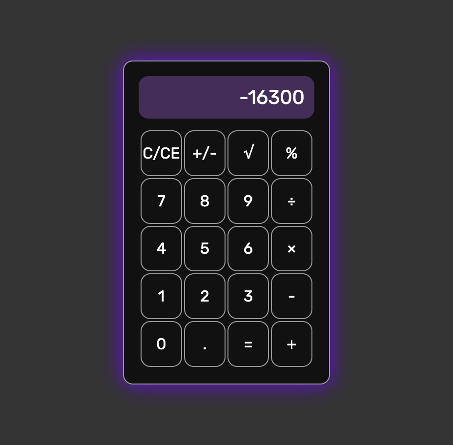

# Low level Calculator

### For run
```bash
> git clone https://github.com/vicimpa/easy-calc
> npm install
> npm run dev
```

### For build
```bash
> git clone https://github.com/vicimpa/easy-calc
> npm install
> npm run build
```

### Screens

>
> 
>
>
> 
>
>
> 
>


